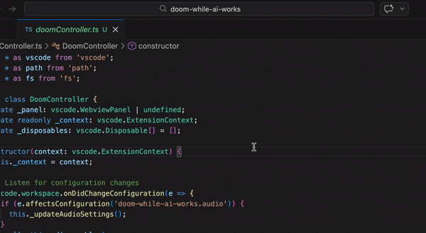

# Doom While AI Works
## Rip and Tear Through the AI Wait Time 🔥

> **"Productivity is overrated. Demon slaying is eternal."**

Tired of staring at that spinning "AI is thinking..." bubble? It's time to slay demons.

**Doom While AI Works** is the ultimate time-killer extension for VS Code, Cursor, and Antigravity. It monitors your editor for AI activity and **instantly launches Doom** when the AI starts processing. The second it finishes? The game pauses, and you're back to work.

### Features
*   **Auto-Slay Trigger**: Launches Doom automatically when AI "thinks".
*   **Instant Pause**: Stops the moment the AI is done. No excuses.
*   **WAD Support**: Built-in Freedoom, or bring your own `.wad` files.
*   **Full Control**: Toggle ON/OFF via status bar, plus adjustable difficulty, volume, and sound settings.

---

### Usage & Controls

The extension adds a status bar item to your IDE, giving you full control over the demon slaying.

| State | Icon | Description |
| :--- | :--- | :--- |
| **ON** |  | **Ready to Slay.** The game will automatically launch when AI starts thinking. Click to disable. |
| **OFF** |  | **Peaceful Mode.** Automatic launch is disabled. Click to enable. |

---

### Setup

#### VS Code (GitHub Copilot)
To ensure Doom triggers correctly with **GitHub Copilot**, you must set the log level to `Debug`.

1.  Open Command Palette (`Cmd+Shift+P` / `Ctrl+Shift+P`).
2.  Run `Developer: Set Log Level`.
3.  Select `GitHub Copilot Chat`.
4.  Select `Debug` and click the **double checkmark icon** on the right to "Set as Default Log Level".

#### Cursor
Doom works by hooking into Cursor's `hooks.json`. A built-in wizard is provided to make this easy.

1.  Launch the extension in Cursor. You will see a notification: **"Doom While AI Works for Cursor: Setup Hooks..."**.
2.  Click **"Show Instructions"**.
3.  A setup guide will open with a JSON snippet.
4.  Copy the JSON and paste it into your `~/.cursor/hooks.json` file.
    *   *This hook simply runs a local command (e.g., `echo thinking > state.txt`) to notify us when AI starts/stops.*

#### Antigravity
**No setup required.** Just install and slay.

---

### Configuration

Customization is key to a good slay. Tweak these settings in your VS Code settings (`Cmd+,`):

| Setting | Description | Default |
| :--- | :--- | :--- |
| `doom-while-ai-works.game.difficulty` | Difficulty level (1: Too young to die - 5: Nightmare!) | `3` |
| `doom-while-ai-works.game.wadPath` | Absolute path to a custom `.wad` file (e.g., `doom1.wad`). | `""` (Freedoom) |
| `doom-while-ai-works.game.skipTitle` | Skip the title screen and start directly in E1M1. | `true` |
| `doom-while-ai-works.audio.volume` | Master volume (0-100). | `100` |
| `doom-while-ai-works.audio.muted` | Mute all game audio. | `false` |
| `doom-while-ai-works.debug` | Enable debug logs for detection hacks. | `true` |

---

### Transparency & AI Detection

**Absolute transparency** is the priority. This extension runs **100% locally** on your machine. No code, prompts, or data are ever sent to any server. It only listens for generic "thinking" signals to trigger the game.

Here is exactly how detection works for each platform:

*   **VS Code (GitHub Copilot)**:
    *   The extension monitors the local output log: `GitHub Copilot Chat.log`.
    *   **Path Example**: `~/Library/Application Support/Code/logs/.../GitHub.copilot-chat/GitHub Copilot Chat.log`
    *   It looks for non-sensitive debug signals like `[debug] AgentIntent:` or `[debug] GH request id:` to detect when a request starts.
    *   **Privacy**: It does NOT process or store your code or prompt text.

*   **Cursor**:
    *   The extension monitors a local state file (e.g., `cursor_ai_state.txt`) managed by **Cursor Hooks**.
    *   **Path Example**: `~/Library/Application Support/Cursor/User/workspaceStorage/.../cursor_ai_state.txt`
    *   You configure the hook to flip this file to "thinking" or "idle".
    *   **Privacy**: It never sees your prompt content, only the start/stop signals you explicitly enabled.

*   **Antigravity**:
    *   The extension polls the local `Antigravity.log` file.
    *   **Path Example**: `~/Library/Application Support/Antigravity/logs/.../Antigravity.log`
    *   It triggers based on generic system events like `Requesting planner`.

You can audit our full detection source code here:
👉 **[src/detectors](https://github.com/Yukapero/doom-for-ai-chat/tree/main/src/detectors)**

---

### Contributing

Bugs? Feature requests? PRs?
I welcome them all. Help make the wait time even more violent.

👉 **[GitHub Repository](https://github.com/Yukapero/doom-for-ai-chat)**

---

### About the Creator

**Yukapero**
Japanese Solopreneur. Full-stack engineer.

👉 **[yukapero.com/en](https://yukapero.com/en)**

---

### License

*   Extension: **MIT License**
*   Game Assets: **Freedoom** (BSD-3-Clause)

*Disclaimer: I am not responsible for your boss catching you mid-frag because the AI was taking its sweet time.*
